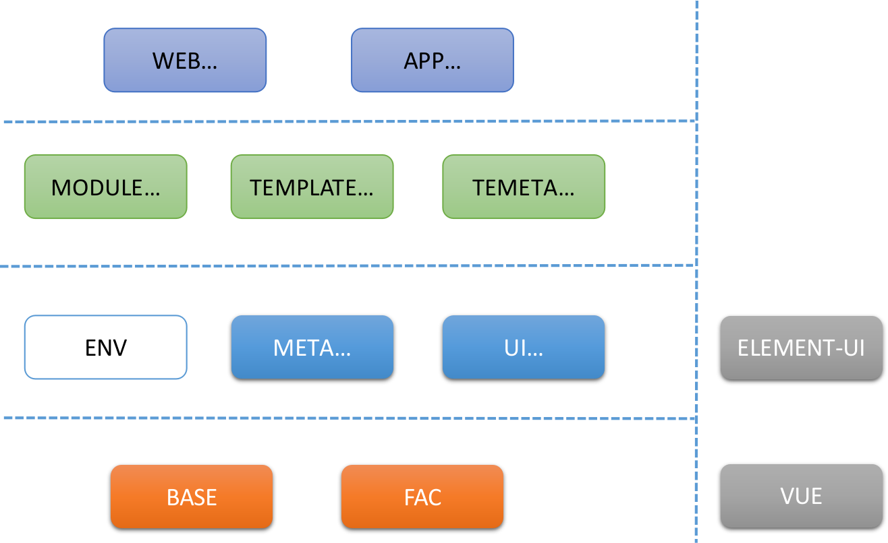
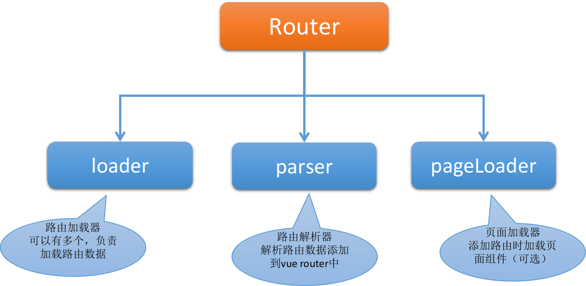
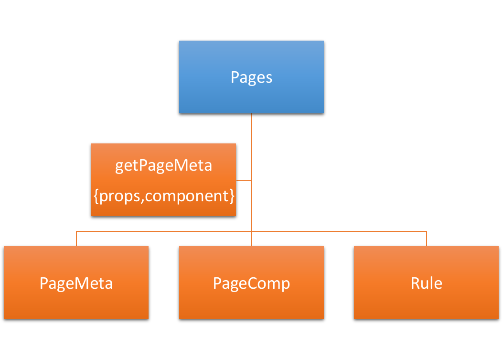
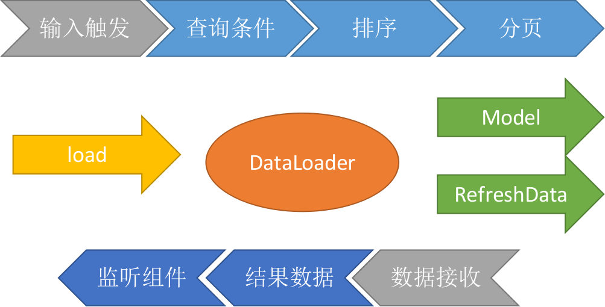
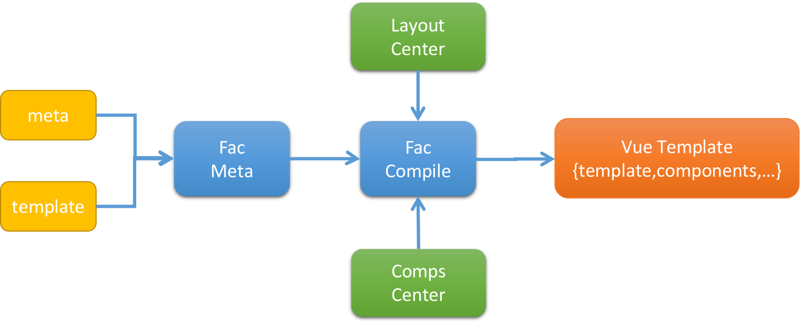
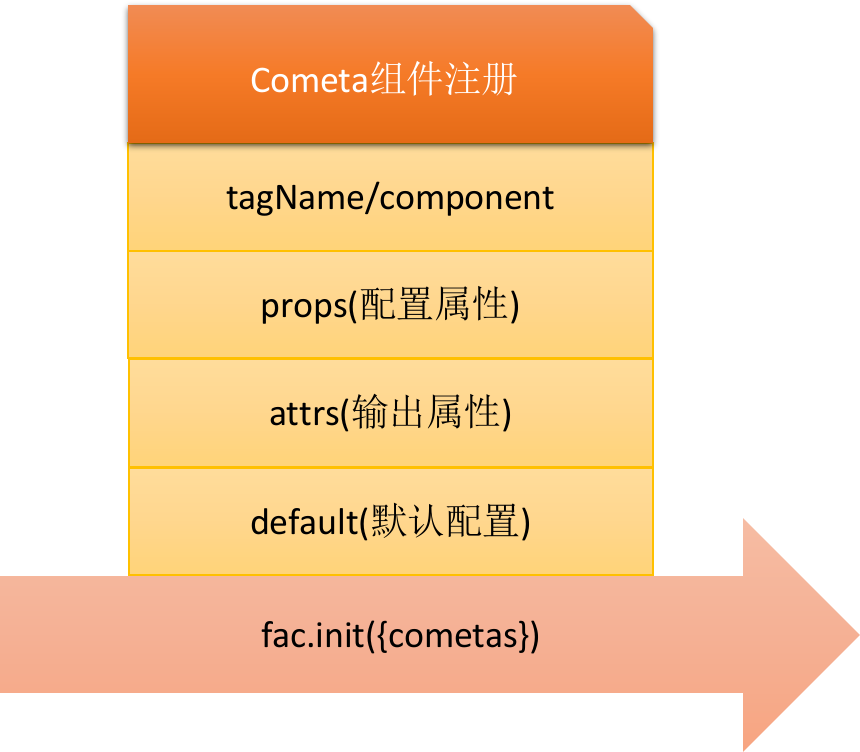
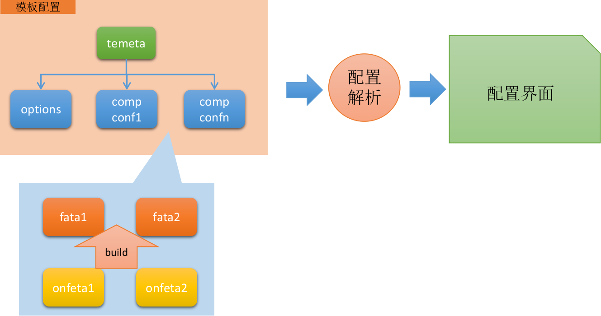
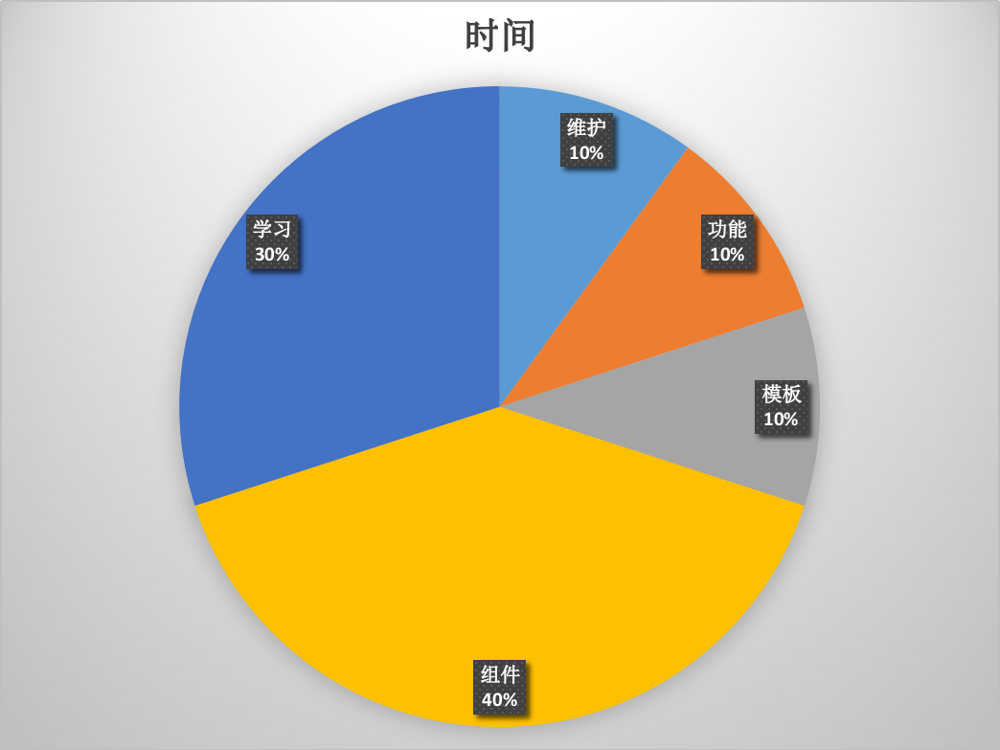

## fansion 前端框架介绍
 *version 1.0.0*

---

### fansion目的

- 应用开发的封装
- 配置化组件（模板引擎）
- 模块化开发与发布
- 成长型框架

---

### fansion的组成

- fansion-base
- fansion-fac
- fansion-ui
- fansion-meta
- fansion-main
- fansion-env

---

### fansion结构



---

### fansion-base 介绍

 标签：`<要素>` `<工具>` `<注册>` `<扩展>`

 - 定义基础组件元素及扩展方式
 - 提供工具方法，扩展方法

---

### fansion-base 基础组件元素及扩展

* 模块间的扩展方式，install&init
* 页面、页面中心
* 页面路由规则
* 对话框、对话框中心、对话框opener
* 数据加载器

---

### fansion-base 路由



---

### fansion-base 页面



---

### fansion-base 数据加载器



---

### fansion-base 工具方法，扩展方法

* 扩展了string,date方法
* util提供常用的工具方法
* rest提供对服务端的访问包装
* 重点工具组件: state、builder、render、mod

---

### fansion-fac 介绍

 标签：`<引擎>` `<布局>` `<元数据>` `<控制方式>`
 
 * fac 模板引擎
 * fayout 布局组件
 * 模板中心、fac元数据中心

---

### fansion-fac 引擎(1)


---

### fansion-fac 引擎(2)



---

### fansion-fac 布局

- fayout通用布局组件
- 注册自定义布局（vue组件），要求布局内容通过slot填充

```
<fac-layout :conf="jsonConfig">
    <component1 slot="a1">
    <component2 slot="a2">
    <component3 slot="a3">
    <component4 slot="a4">
</fac-layout>

```

---

### fansion-ui 介绍

 标签：`<组件>` `<实现>` `<元数据>`
 
 * 对话框opener与message的实现
 * 组件实现，引用容器
 * 组件注册
 * 引用规范，引用注册，及引用容器
 * 代码生成器，处理封装（例）

---

### fansion-ui 组件注册

 

---

### fansion-meta

 标签：`<元元数据>` `<配置>`
 
 * 组件配置(注册)confeta->fata(fac meta)组件界面配置(使用)元数据
 * temeta模板元数据
 * 元数据配置
    * 模型配置
    * 模板配置

---

### fansion-meta



---

### fansion-main和fansion-env

- fansion-main工程
- fansion-env应用开发环境

---

### fansion存在问题

- 模块中chunk文件问题
- 未完成校验配置化
- 语法不规范
- 加入运行时模板
- 加入脚手架
- 无移动组件
- 尚未优化
- 平台化配置

---

### 理想的开发时间


